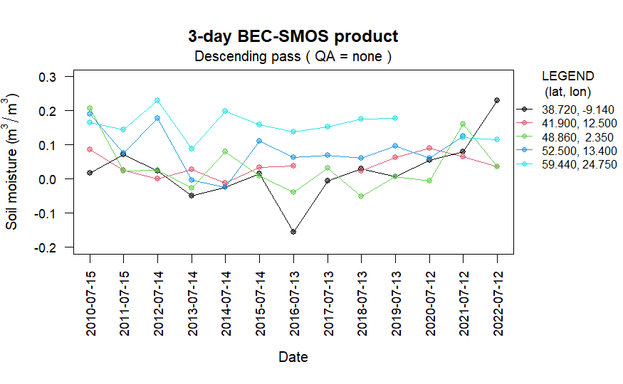
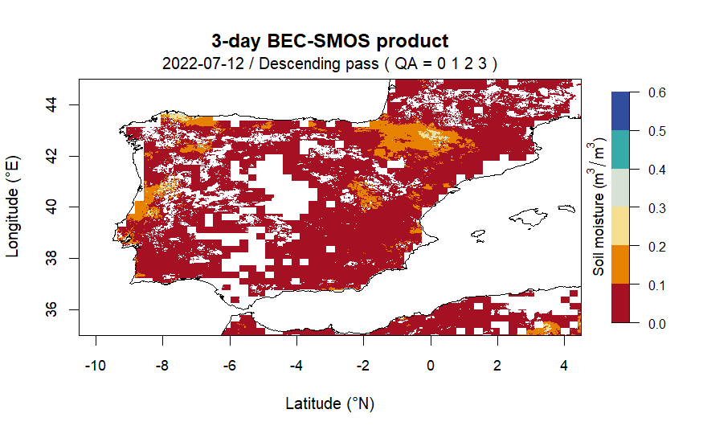

<!-- README.md is generated from README.Rmd. Please edit that file -->

[](https://github.com/tshestakova/smosr/actions/workflows/R-CMD-check.yaml)
# smosr

## Overview

The goal of smosr is to automate accessing, downloading and importing
ESA-BEC Soil Moisture and Ocean Salinity (SMOS) data into R.
Particularly, it includes functions to search for, acquire, extract, and
plot BEC-SMOS L4 soil moisture data downscaled to ~1 km spatial
resolution (EASE-grid v.2).

## Installation

Install the released version of `smosr` from
[CRAN](https://cran.r-project.org/):

``` r
# The easiest way to get dplyr is to install the whole tidyverse:
install.packages("smosr")
```

### Development version

To get a bug fix or to use new features of the package, you can install
the development version of `smosr` from [GitHub](https://github.com/):

``` r
# install.packages("devtools")
devtools::install_github("tshestakova/smosr")
```

## Usage

``` r
library(smosr)

# # to set credentials for accessing BEC server
# # note that "username" and "password" should be replaced with your login details
# set_credentials("username", "password")

# to search for SMOS data with the specified parameters available on the server
start_date <- as.Date("2010-07-15")
end_date <- as.Date("2022-07-15")
date_range <- seq(start_date, end_date, by = 365)
smos_data <- find_smos(freq = 3, orbit = "des", dates = date_range)
#> Done. All requested files were successfully found.

# to download the data from the server to a local computer
dir.create("~/sm_example")
#> Warning in dir.create("~/sm_example"):
#> 'C:\Users\tshestakova\Documents\sm_example' already exists
download_smos(data = smos_data, dir = "~/sm_example")
#> |================================================================================| 100%

# to list BEC-SMOS data files stored in the specified folder
smos_files <- list_smos(dir = "~/sm_example")
head(smos_files, 5)
#> [1] "C:/Users/tshestakova/Documents/sm_example/BEC_SM____SMOS__EUM_L4__D_20100715T183618_001km_3d_REP_v6.0.nc"
#> [2] "C:/Users/tshestakova/Documents/sm_example/BEC_SM____SMOS__EUM_L4__D_20110715T182802_001km_3d_REP_v6.0.nc"
#> [3] "C:/Users/tshestakova/Documents/sm_example/BEC_SM____SMOS__EUM_L4__D_20120714T182030_001km_3d_REP_v6.0.nc"
#> [4] "C:/Users/tshestakova/Documents/sm_example/BEC_SM____SMOS__EUM_L4__D_20130714T181231_001km_3d_REP_v6.0.nc"
#> [5] "C:/Users/tshestakova/Documents/sm_example/BEC_SM____SMOS__EUM_L4__D_20140714T180441_001km_3d_REP_v6.0.nc"

# to extract soil moisture estimates for the specified geographical locations
# from the list of data files obtained in the previous steps
lat <- c(38.72, 41.90, 48.86, 52.50, 59.44)
lon <- c(-9.14, 12.50, 2.35, 13.40, 24.75)
sm_estimates <- extract_smos(data = smos_files, lat = lat, lon = lon)
#> |================================================================================| 100%

head(sm_estimates, 12)
#>       Lat     Lon     Freq Orbit Date         Time       SM                     QA
#>  [1,] "38.72" "-9.14" "3d" "D"   "2010-07-15" "20:36:18" "0.0176999995528604"   "5"
#>  [2,] "41.9"  "12.5"  "3d" "D"   "2010-07-15" "20:36:18" "0.0872999977946165"   "7"
#>  [3,] "48.86" "2.35"  "3d" "D"   "2010-07-15" "20:36:18" "0.206299994788424"    "2"
#>  [4,] "52.5"  "13.4"  "3d" "D"   "2010-07-15" "20:36:18" "0.191299995167356"    "6"
#>  [5,] "59.44" "24.75" "3d" "D"   "2010-07-15" "20:36:18" "0.165999995806487"    "7"
#>  [6,] "38.72" "-9.14" "3d" "D"   "2011-07-15" "20:28:02" "0.071999998181127"    "3"
#>  [7,] "41.9"  "12.5"  "3d" "D"   "2011-07-15" "20:28:02" "0.025399999358342"    "7"
#>  [8,] "48.86" "2.35"  "3d" "D"   "2011-07-15" "20:28:02" "0.0235999994038139"   "6"
#>  [9,] "52.5"  "13.4"  "3d" "D"   "2011-07-15" "20:28:02" "0.0769999980548164"   "2"
#> [10,] "59.44" "24.75" "3d" "D"   "2011-07-15" "20:28:02" "0.144699996344571"    "7"
#> [11,] "38.72" "-9.14" "3d" "D"   "2012-07-14" "20:20:31" "0.0246999993760255"   "5"
#> [12,] "41.9"  "12.5"  "3d" "D"   "2012-07-14" "20:20:31" "0.000499999987368938" "7"

# to plot extracted temporal series of soil moisture data
plot_temporal_smos(data = sm_estimates)
```



``` r
# to draw a raster image of soil moisture estimates from a file with
# desired data quality and within the specified geographical bounds
lat <- c(35.00, 45.00)
lon <- c(-10.50, 4.50)
plot_raster_smos(data = smos_files[13], lat = lat, lon = lon, QA = c(0,1,2,3))
```



## Getting help

If you encounter a clear bug, please file an issue with a minimal
reproducible example on
[GitHub](https://github.com/tshestakova/smosr/issues).

For questions and other discussion, please use [Stack
Overflow](https://stackoverflow.com/questions/) and the [RStudio
community](https://community.rstudio.com/).
